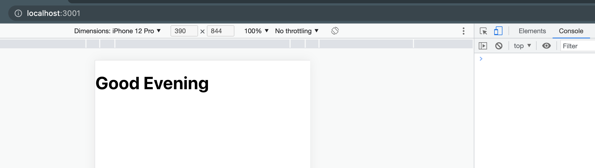

# Hello React Front-End

> This web app helps you get random greeting messages from Rails API backend deployed separately.

> This project is built as part of Microverse program.

## Built With

- Javascript
- React, Redux, Jest, React Testing Library
- CSS

## Live Demo
This is web app is not yet deployed!

## Getting Started

To run this application please follow these steps:

- Install Node.js ^14.0
- clone the repository by running\
    `git clone https://github.com/billionsjoel/hello-react-frontend.git`
- navigate to the folder\
    `cd hello-react-frontend`
- Install packages\
    `npm install`
- run the application\
    `npm start`

## Author

👤 **Atugonza (Billions Joel)**

- GitHub: [@gtekle](https://github.com/billionsjoel)
- LinkedIn: [@gtekle](www.linkedin.com/in/billionsjoel)

## 🤝 Contributing

Contributions, issues, and feature requests are welcome!

Feel free to check the [issues page](../../issues/).

## Show your support

Give a ⭐️ if you like this project!

## Acknowledgments

- Special thanks to Microverse

## 📝 License

This project is [MIT](./MIT.md) licensed.